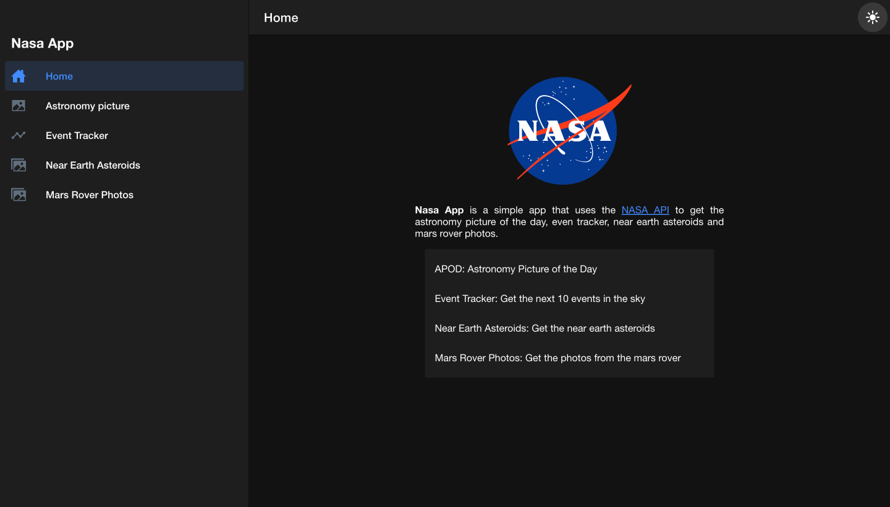
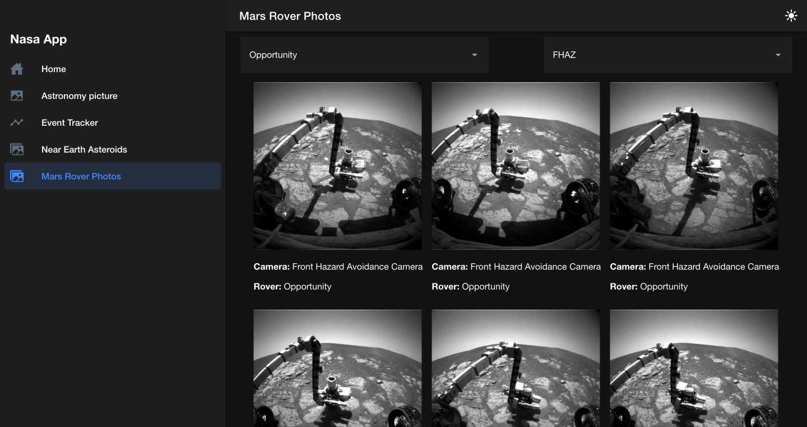

# Nasa App

## Table of contents

- [Description](#description)
- [Technologies](#technologies)
- [Environment Variables](#environment-variables)
- [Installation](#installation)
- [Screenshots](#screenshots)
    - [IOS](#ios)
    - [Web](#web)
- [Contributing](#contributing)
- [License](#license)

## Description

This is a simple app that uses the NASA API to get the astronomy picture of the day, event tracker, near earth asteroids and mars rover photos.

## Technologies

- [React](https://reactjs.org/)
- [TypeScript](https://www.typescriptlang.org/)
- [Ionic](https://ionicframework.com/)
- [NASA API](https://api.nasa.gov/)

## Environment Variables

To run this project, you will need to add the following environment variables to your .env file

`REACT_APP_NASA_API_KEY = your NASA API key`

## Installation

Clone the repository and run the following commands:

```bash
npm install
npm start
```

## Screenshots

### IOS
<div style="display: flex; flex-direction: row; justify-content: space-between; gap:10px">
  
  
  
</div>

### Web

<div style="display: flex; flex-direction: row; justify-content: space-between; gap:10px">
  
  
</div>

## Demo

[Demo](https://nasaapp.vercel.app)


## Contributing

Pull requests are welcome. For major changes, please open an issue first to discuss what you would like to change.

Please make sure to update tests as appropriate.

## License

[MIT](https://choosealicense.com/licenses/mit/)
